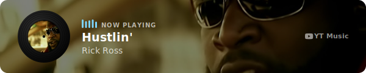

# YTMusicDisplayWidget

A self-committing GitHub Action that renders a "now playing" SVG card from a YouTube or YouTube Music link — for embedding in your GitHub profile README. It's decorative, not a live listening integration: you configure one track or a small playlist, and the action renders + commits the card on whatever schedule you choose.

## Examples

| `art-style: static` | `art-style: vinyl` |
|---|---|
|  |  |
|  |  |

## Quick start

1. Add a workflow file to your repo, e.g. `.github/workflows/now-playing.yml`:

   ```yaml
   name: Update now-playing card
   on:
     schedule:
       - cron: '0 */6 * * *'   # every 6 hours — adjust to taste
     workflow_dispatch:        # lets you trigger it manually from the Actions tab
   jobs:
     update:
       runs-on: ubuntu-latest
       permissions:
         contents: write       # required — the action commits its own output
       steps:
         - uses: actions/checkout@v4
         - uses: <your-username>/ytmusic-display-widget@v1
           with:
             tracks: |
               https://music.youtube.com/watch?v=4NRXx6U8ABQ
   ```

2. Commit and push that workflow file. It'll run on its schedule, or you can trigger it immediately from your repo's **Actions** tab → this workflow → **Run workflow**.
3. The action commits a generated SVG (default path `now-playing.svg`) to your repo each run.
4. Embed it in your README, wrapping it in a link to the track so clicking it opens YouTube Music:

   ```markdown
   [](https://music.youtube.com/watch?v=4NRXx6U8ABQ)
   ```

5. To use a rotating playlist instead of one fixed track, list multiple `tracks` (one per line) and set `mode: sequential` (advances through the list once per run) or leave `mode: random` (default).

## Inputs

| Input | Default | Description |
|---|---|---|
| `tracks` | *(required)* | One or more YouTube/YouTube Music URLs, one per line |
| `mode` | `random` | `random` \| `sequential` — which track to pick when more than one is given |
| `size` | `banner` | `banner` (600×120) \| `compact` (300×80) |
| `art-style` | `static` | `static` \| `vinyl` |
| `art-shape` | `circle` | `circle` \| `square` — `static` style only |
| `accent-color` | `#7dd3fc` | Hex color for the equalizer bars and badge |
| `vinyl-speed` | `normal` | `slow` \| `normal` \| `fast` — `vinyl` style only |
| `label-size` | `small` | `small` \| `large` — `vinyl` style only |
| `output-path` | `now-playing.svg` | Where to write the generated SVG |
| `state-path` | `.now-playing-state.json` | Where `sequential` mode persists its position |

## Outputs

| Output | Description |
|---|---|
| `track-url` | The URL of the track rendered this run |
