# YTMusicDisplayWidget

A self-committing GitHub Action that renders a "now playing" SVG card from a YouTube or YouTube Music link — for embedding in your GitHub profile README. It's decorative, not a live listening integration: you configure one fixed track, or a small rotating playlist, and the action renders + commits the card. A scheduled trigger only matters for the playlist case — see [Quick start](#quick-start) step 5.

## Examples

Every `art-style`, shown at size `l`:

| Style | Example |
|---|---|
| `static` |  |
| `vinyl` |  |
| `cassette` |  |
| `neon` |  |
| `vinyl-sleeve` |  |

## Sizes

Four size tiers — `s`, `m`, `l`, `xl` — shown here with the `static` style:

| Size | Dimensions | Example |
|---|---|---|
| `s` | 260×68 |  |
| `m` | 300×80 |  |
| `l` | 600×120 |  |
| `xl` | 760×150 |  |

## Quick start

1. Add a workflow file to your repo, e.g. `.github/workflows/now-playing.yml`:

   ```yaml
   name: Update now-playing card
   on:
     workflow_dispatch:   # trigger it manually from the Actions tab
   jobs:
     update:
       runs-on: ubuntu-latest
       permissions:
         contents: write   # required — the action commits its own output
       steps:
         - uses: actions/checkout@v4
         - uses: <your-username>/ytmusic-display-widget@v1
           with:
             tracks: |
               https://music.youtube.com/watch?v=JU9TouRnO84
   ```

2. Commit and push that workflow file, then trigger it from your repo's **Actions** tab → this workflow → **Run workflow**.
3. The action commits a generated SVG (default path `now-playing.svg`) to your repo each run.
4. Embed it in your README, wrapping it in a link to the track so clicking it opens YouTube Music:

   ```markdown
   [](https://music.youtube.com/watch?v=JU9TouRnO84)
   ```

5. **A single fixed track renders identically every run** — `workflow_dispatch` is all you need; there's no point scheduling it. Scheduling only earns its keep with a rotating **playlist**: list multiple `tracks` (one per line) and set `mode: sequential` (advances through the list once per run) or leave `mode: random` (default). Only then does re-running on a `schedule` trigger actually change anything:

   ```yaml
   on:
     schedule:
       - cron: '0 */6 * * *'   # every 6 hours — adjust to taste
     workflow_dispatch:
   # ...
     with:
       tracks: |
         https://music.youtube.com/watch?v=JU9TouRnO84
         https://music.youtube.com/watch?v=9kT0oLBPiOw
       mode: random
   ```

## Choosing a style

Every option — `art-style`, `size`, colors, speeds — is just another key in the same `with:` block as `tracks`, added to the workflow step from Quick start above. For example, to switch to the spinning `vinyl-sleeve` look, render it at size `m`, and use a custom accent and wave color:

```yaml
- uses: <your-username>/ytmusic-display-widget@v1
  with:
    tracks: |
      https://music.youtube.com/watch?v=JU9TouRnO84
    art-style: vinyl-sleeve
    size: m
    accent-color: "#ff2ea6"
    wave-color: "#22d3ee"
```

Pick any `art-style` value from the [Examples](#examples) table above, then check the Inputs table below for the options that style supports — a few inputs (`vinyl-speed`, `label-size`, `art-shape`, `background`) only affect specific styles and are ignored otherwise.

## Background modes

`background` is a customization, not a style — it works with any `art-style` (except `neon`, which always keeps its flat backdrop). `blurred` (default) is a soft glass backdrop behind the art; `full` is a crisp edge-to-edge cover image with a scrim, so the album art fills the whole card behind the text:

| `background: blurred` (default) | `background: full` |
|---|---|
|  |  |

## Inputs

| Input | Default | Description |
|---|---|---|
| `tracks` | *(required)* | One or more YouTube/YouTube Music URLs, one per line |
| `mode` | `random` | `random` \| `sequential` — which track to pick when more than one is given |
| `size` | `l` | `s` (260×68) \| `m` (300×80) \| `l` (600×120) \| `xl` (760×150) |
| `art-style` | `static` | `static` \| `vinyl` \| `cassette` \| `neon` \| `vinyl-sleeve` |
| `art-shape` | `circle` | `circle` \| `square` — `static` style only |
| `accent-color` | `#7dd3fc` | Hex color for the neon art style's glow ring; also `wave-color`'s default |
| `wave-color` | *(= accent-color)* | Hex color for the waveform (`l`/`xl`) or equalizer bars (`s`/`m`) |
| `vinyl-speed` | `normal` | `slow` \| `normal` \| `fast` — applies to `vinyl`, `cassette`, `vinyl-sleeve` |
| `label-size` | `small` | `small` \| `large` — applies to `vinyl` and `vinyl-sleeve` |
| `background` | `blurred` | `blurred` \| `full` — see [Background modes](#background-modes). Ignored by `neon` |
| `output-path` | `now-playing.svg` | Where to write the generated SVG |
| `state-path` | `.now-playing-state.json` | Where `sequential` mode persists its position |

## Outputs

| Output | Description |
|---|---|
| `track-url` | The URL of the track rendered this run |
